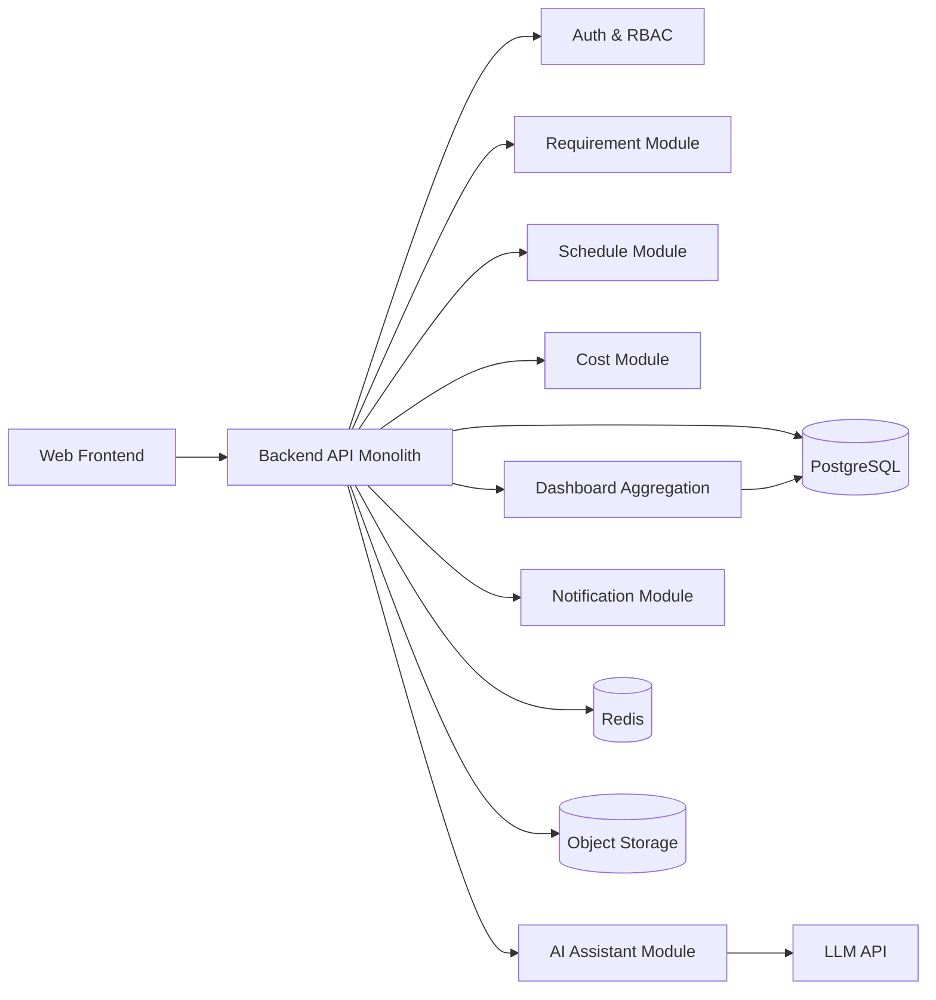

# 多项目智能管理系统技术规格说明书（spec.md）

## 1. 项目概述（Project Overview）

### 1.1 背景
中小软件团队的项目经理常同时管理多个项目，需求、成本、进度信息分散在文档、IM、表格和会议中，导致跨项目统筹效率低、风险识别滞后、汇报成本高。

### 1.2 产品目标
构建一套面向中小团队项目经理的多项目管理系统，实现以下目标：
- 统一管理需求全生命周期（评审、变更、版本）
- 建立成本透明体系（人力工时 + 外采/云资源，预算 vs 实际）
- 提供进度可视化与风险预警（甘特/WBS、看板、里程碑）
- 提供 AI 项目经理助理，降低周报与分析耗时

### 1.3 用户画像
- 核心用户：中小团队项目经理（5-80 人团队）
- 次级用户：研发负责人、产品经理、技术负责人、财务协同角色（只读/审批）

### 1.4 核心使用流程
1. PM 创建项目与版本计划，录入预算与里程碑
2. 团队提交与评审需求，形成版本范围
3. 执行阶段持续更新任务、工时、外采/云成本
4. 系统自动计算进度偏差、成本偏差、风险等级
5. Dashboard 展示多项目健康度，AI 输出风险摘要与周报草稿

---

## 2. 产品范围（Product Scope）

### 2.1 MVP 功能清单
- 多项目工作台与 Dashboard
- 需求管理：需求池、优先级、评审流程、变更追踪、版本规划
- 成本管理：工时成本、外采成本、云资源成本、预算 vs 实际、超预算预警
- 进度管理：甘特/WBS、看板、里程碑、延期风险预警
- AI 助理：风险解读、异常原因摘要、周报草稿生成
- 基础能力：登录、RBAC、审计日志、通知

### 2.2 非目标功能（Out of Scope）
- 通用低代码平台能力（可视化任意业务搭建）
- 完整 DevOps 流水线编排
- 企业级复杂组织治理（多法人、多账套、多层审批引擎）
- 财务核算/税务替代系统

---

## 3. 用户体验（UX & Interaction）

### 3.1 关键页面/交互说明
- 登录页：账号密码 + 组织选择
- Dashboard（多项目驾驶舱）：
  - 健康度总览（绿/黄/红）
  - 延期风险与超预算风险卡片
  - 待评审需求、变更趋势、里程碑偏差
  - AI 风险摘要与周报生成入口
- 项目详情页：
  - 标签页：需求 / 进度 / 成本 / 风险 / 文档
  - 需求评审与变更历史时间线
- 进度页：
  - 甘特/WBS 视图
  - 看板视图（待办/进行中/阻塞/完成）
- 成本页：
  - 预算配置
  - 成本录入（工时、外采、云资源）
  - 预算偏差与趋势图

### 3.2 典型用户路径（User Flow）
1. PM 登录 -> 创建项目 -> 设置预算与里程碑
2. PM 创建需求 -> 发起评审 -> 通过后纳入版本
3. 团队更新任务状态/工时 -> 系统同步更新进度与成本
4. 系统触发风险规则 -> Dashboard 警报
5. PM 点击 AI 助理 -> 获取风险解释与周报草稿 -> 导出分享

---

## 4. 系统架构（System Architecture）

### 4.1 架构说明
采用模块化单体（Modular Monolith）架构，优先交付速度与可维护性。通过清晰领域边界、异步任务与聚合表机制，兼顾后续服务化演进。

### 4.2 架构图


### 4.3 模块拆解
- `Auth & RBAC`：身份鉴权、角色权限、操作审计
- `Requirement`：需求生命周期与版本规划
- `Schedule`：WBS/甘特/里程碑/看板
- `Cost`：工时与外采/云成本核算
- `Dashboard`：指标聚合、风险评分、可视化数据接口
- `AI Assistant`：基于业务数据生成风险解释与周报草稿
- `Notification`：站内通知/邮件（预警与待办）

---

## 5. 技术栈（Tech Stack）

### 5.1 前端
- React + TypeScript
- Ant Design Pro（管理端 UI）
- ECharts（仪表盘）
- 甘特组件（如 dhtmlx-gantt 或等价方案）

### 5.2 后端
- NestJS（Node.js）
- Prisma ORM
- REST API（MVP）

### 5.3 AI / 模型层
- LLM API（OpenAI 兼容）
- Prompt 模板管理（版本化）
- 事实约束生成（仅引用系统结构化数据）

### 5.4 数据层
- PostgreSQL（主业务库）
- Redis（缓存、队列、短期会话）

### 5.5 基础设施
- Docker + Nginx
- GitHub Actions（CI/CD）
- 监控：基础日志 + 错误告警（Sentry/等价）

---

## 6. 核心模块设计

### 6.1 需求管理模块
- 职责：需求收集、评审、变更、版本归属
- 输入：需求标题/描述/优先级/业务价值/版本目标
- 输出：需求状态、评审记录、变更历史、版本清单
- 关键逻辑：
  - 状态流转：`draft -> in_review -> approved -> planned -> done`
  - 变更必须记录差异与原因
  - 版本容量超阈值时给出提示

### 6.2 成本管理模块
- 职责：汇总工时、外采、云资源成本，计算预算偏差
- 输入：工时日志、单价、外采单、云账单、预算
- 输出：项目/迭代成本、预算偏差、预警状态
- 关键逻辑：
  - 人力成本 = 工时 * 人员费率
  - 总成本 = 人力 + 外采 + 云资源
  - 偏差率 = (实际 - 预算) / 预算

### 6.3 进度管理模块
- 职责：任务分解、排期跟踪、里程碑监控
- 输入：WBS、依赖关系、计划/实际起止时间、任务状态
- 输出：进度偏差、关键路径状态、里程碑达成率
- 关键逻辑：
  - 关键路径任务延期触发高优先级风险
  - 连续阻塞任务超过阈值触发预警

### 6.4 Dashboard 模块
- 职责：多项目关键指标统一展示
- 输入：需求/进度/成本/风险聚合数据
- 输出：健康度、趋势图、风险列表、待办清单
- 关键逻辑：
  - 定时任务每 5-15 分钟刷新聚合表
  - 支持按组织/项目/版本过滤

### 6.5 AI 助理模块
- 职责：风险解读、异常归因、周报草稿生成
- 输入：结构化业务数据 + 最近变更事件
- 输出：可追溯结论（含依据字段/时间范围）
- 关键逻辑：
  - 严格事实约束（禁止编造）
  - 高风险建议附人工确认提示
  - 保存生成记录用于审计

---

## 7. 数据设计（Data Design）

### 7.1 核心对象
- Organization, User, Project, Version
- Requirement, RequirementReview, RequirementChange
- Task, Milestone, Worklog
- CostEntry, Budget
- RiskEvent, DashboardSnapshot, AIReport

### 7.2 表结构 / Schema 示例
```sql
CREATE TABLE projects (
  id BIGSERIAL PRIMARY KEY,
  org_id BIGINT NOT NULL,
  name VARCHAR(128) NOT NULL,
  owner_id BIGINT NOT NULL,
  status VARCHAR(32) NOT NULL DEFAULT 'active',
  start_date DATE,
  end_date DATE,
  created_at TIMESTAMP NOT NULL DEFAULT NOW(),
  updated_at TIMESTAMP NOT NULL DEFAULT NOW()
);

CREATE TABLE requirements (
  id BIGSERIAL PRIMARY KEY,
  project_id BIGINT NOT NULL,
  version_id BIGINT,
  title VARCHAR(255) NOT NULL,
  description TEXT,
  priority VARCHAR(16) NOT NULL,
  status VARCHAR(32) NOT NULL,
  proposer_id BIGINT NOT NULL,
  created_at TIMESTAMP NOT NULL DEFAULT NOW(),
  updated_at TIMESTAMP NOT NULL DEFAULT NOW()
);

CREATE TABLE cost_entries (
  id BIGSERIAL PRIMARY KEY,
  project_id BIGINT NOT NULL,
  type VARCHAR(16) NOT NULL, -- labor|outsource|cloud
  amount NUMERIC(14,2) NOT NULL,
  currency VARCHAR(8) NOT NULL DEFAULT 'CNY',
  occurred_on DATE NOT NULL,
  source_ref VARCHAR(128),
  created_by BIGINT NOT NULL,
  created_at TIMESTAMP NOT NULL DEFAULT NOW()
);

CREATE TABLE dashboard_snapshots (
  id BIGSERIAL PRIMARY KEY,
  project_id BIGINT NOT NULL,
  snapshot_time TIMESTAMP NOT NULL,
  health_score INT NOT NULL,
  budget_variance_rate NUMERIC(8,4),
  schedule_variance_days INT,
  open_risk_count INT NOT NULL DEFAULT 0
);
```

### 7.3 关键字段说明
- `health_score`：0-100，综合需求稳定性/进度偏差/成本偏差计算
- `budget_variance_rate`：预算偏差率，正值代表超预算
- `schedule_variance_days`：里程碑计划与实际偏移天数
- `type`（cost_entries）：区分成本口径，确保可核对

---

## 8. 接口设计（API / Service）

### 8.1 关键接口清单
- `POST /api/v1/projects` 创建项目
- `GET /api/v1/dashboard/overview` 多项目总览
- `POST /api/v1/requirements` 创建需求
- `POST /api/v1/requirements/{id}/review` 提交评审结果
- `POST /api/v1/requirements/{id}/change` 记录需求变更
- `POST /api/v1/worklogs` 提交工时
- `POST /api/v1/cost-entries` 录入外采/云成本
- `GET /api/v1/projects/{id}/schedule` 获取甘特/WBS数据
- `GET /api/v1/projects/{id}/risks` 获取风险列表
- `POST /api/v1/ai/reports/weekly` 生成周报草稿

### 8.2 示例请求结构
```http
POST /api/v1/cost-entries
Content-Type: application/json
Authorization: Bearer <token>

{
  "projectId": 1001,
  "type": "cloud",
  "amount": 2350.50,
  "currency": "CNY",
  "occurredOn": "2026-02-21",
  "sourceRef": "ALIYUN-BILL-2026-02"
}
```

```http
POST /api/v1/ai/reports/weekly
Content-Type: application/json

{
  "projectIds": [1001, 1002],
  "weekStart": "2026-02-16",
  "weekEnd": "2026-02-22",
  "includeRisks": true,
  "includeBudget": true
}
```

---

## 9. 实现步骤（Implementation Steps）

### Step 1：最小可跑通版本（4-6 周）
- 完成用户登录、组织/项目管理、RBAC 基础
- 完成需求管理基础流（创建、评审、版本归档）
- 完成工时与成本录入、预算配置
- 完成里程碑管理与看板基础
- Dashboard 上线核心 6 个指标卡

### Step 2：核心能力补全（4-8 周）
- 补齐甘特/WBS 与任务依赖
- 上线需求变更追踪与审计时间线
- 上线风险规则引擎（延期/超预算/阻塞）
- AI 助理上线：风险摘要 + 周报草稿
- 增加通知中心与邮件预警

### Step 3：工程化 / 扩展（持续）
- 聚合查询性能优化（物化聚合 + 缓存）
- 完善监控、审计、重试与幂等
- 增加导出、权限细化、模板配置
- 为后续服务化预留事件总线接口

---

## 10. 风险与演进（Risk & Evolution）

### 10.1 技术风险
- 风险预警准确度不足，可能造成告警疲劳
- Dashboard 查询复杂度上升导致性能瓶颈
- AI 输出可信度与可解释性要求高
- 成本数据来源异构，口径不一致

### 10.2 应对策略
- 先规则后模型：先做可解释规则引擎，再引入预测模型
- 聚合表 + 缓存 + 增量刷新，避免在线复杂联表
- AI 输出附依据字段与时间窗口，支持“追溯来源”
- 定义统一成本字典和口径版本，保证统计一致

### 10.3 可扩展方向
- 从单体平滑演进到服务化（需求/成本/进度/查询拆分）
- 引入预测模型（延期概率、超预算概率）
- 与 Jira/GitLab/云账单系统做双向集成
- 多组织租户隔离与企业级权限增强

